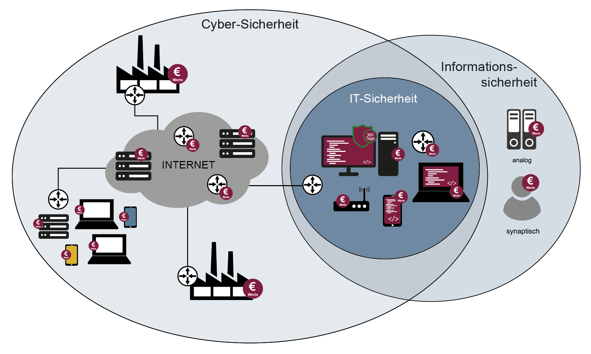

# Cyber-Security

[Cyber-Sicherheit, Norbert Pohlmann](https://norbert-pohlmann.com/glossar-cyber-sicherheit/cyber-sicherheit-2/)

## Arten von Cyber Security

1. ### Netzwerksicherheit

   `Was ist das?` Schutz von Computernetzwerken vor unbefugtem Zugriff, Missbrauch und Angriffen.
   `Beispiel:` Eine Firewall auf einem Heimrouter blockiert unautorisierte Verbindungsversuche aus dem Internet und verhindert, dass Hacker auf das Heimnetzwerk zugreifen.
   `Wie:`

   - Firewalls: Schützen Netzwerke, indem sie eingehenden und ausgehenden Datenverkehr überwachen und Regeln anwenden, um Angriffe abzuwehren.
   - Intrusion Detection Systems (IDS) & Intrusion Prevention Systems (IPS): Erkennen und verhindern potenziell schädliche Aktivitäten im Netzwerk.
   - Virtual Private Networks (VPNs): Bieten eine sichere Verbindung über unsichere Netzwerke, wie das Internet, indem sie den Datenverkehr verschlüsseln.

2. ### Anwendungssicherheit

   `Was ist das?` Sicherstellung, dass Softwareanwendungen frei von Schwachstellen sind, die von Angreifern ausgenutzt werden könnten.
   `Beispiel:` Ein Online-Shop überprüft sorgfältig alle Eingaben in Suchfelder, um sicherzustellen, dass niemand schädlichen Code einschleusen kann (z. B. durch SQL-Injection).
   `Wie:`

   - Sichere Softwareentwicklung: Implementierung von Sicherheitspraktiken während des gesamten Softwareentwicklungsprozesses, um Schwachstellen zu minimieren (z. B. OWASP Top 10).
   - Penetrationstests: Simulierte Angriffe auf Anwendungen, um Schwachstellen zu identifizieren und zu beheben.
   - Code Reviews & Static Analysis Tools: Überprüfung von Quellcode auf potenzielle Sicherheitslücken.

3. ### Endpunktsicherheit

   `Was ist das?` Schutz von Geräten, die mit einem Netzwerk verbunden sind, wie Computer, Smartphones und Tablets.
   `Beispiel:` Ein Antivirus-Programm auf einem Laptop erkennt und blockiert einen heruntergeladenen Virus, bevor er Schaden anrichten kann.
   `Wie:`
   - Antivirus/Antimalware-Software: Schutz von Endgeräten (z. B. PCs, Laptops, Smartphones) vor Schadsoftware.
    - Endpoint Detection and Response (EDR): Fortgeschrittene Tools, die Bedrohungen auf Endgeräten erkennen und darauf reagieren können.
    - Device Management: Verwaltung von Sicherheitsrichtlinien und Software auf Endgeräten.

4. ### Identitäts- und Zugriffsmanagement (IAM)

   `Was ist das?` Verwaltung von Benutzeridentitäten und Kontrolle, wer auf welche Ressourcen zugreifen darf.
   `Beispiel:` Bei einer Bank-App wird eine Zwei-Faktor-Authentifizierung verwendet, bei der der Benutzer neben dem Passwort auch einen Code eingeben muss, der auf sein Handy gesendet wird.
   `Wie:`

    - Multi-Factor Authentication (MFA): Verwendung mehrerer Authentifizierungsmethoden (z. B. Passwort und biometrische Daten), um die Sicherheit zu erhöhen.
    - Single Sign-On (SSO): Ermöglicht Benutzern den Zugriff auf mehrere Systeme mit einem einzigen Anmeldevorgang.
    - Privileged Access Management (PAM): Verwaltung und Überwachung von privilegierten Konten mit erweitertem Zugriff auf kritische Systeme.

5. ### Kryptographie

   `Was ist das?` Schutz von Informationen durch Verschlüsselung, sodass nur berechtigte Parteien Zugriff darauf haben.
   `Beispiel:` Wenn du eine Nachricht über einen sicheren Messenger wie WhatsApp sendest, wird diese verschlüsselt, sodass nur der Empfänger sie lesen kann.
   `Wie:`
   - Verschlüsselung: Schutz von Daten durch Umwandlung in eine unlesbare Form, die nur mit einem Schlüssel wiederhergestellt werden kann.
    - Public Key Infrastructure (PKI): Verwaltung von digitalen Zertifikaten und öffentlichen Schlüsseln, um sichere Kommunikation und Authentifizierung zu gewährleisten.
    - Hashing: Erzeugung eines eindeutigen, festen Datenwerts aus beliebigen Daten, der als Fingerabdruck dieser Daten verwendet wird.

6. ### Bedrohungsanalyse und -management

   `Was ist das?` Erkennung und Reaktion auf potenzielle Sicherheitsbedrohungen.
   `Beispiel:` Ein Unternehmen verwendet ein Überwachungssystem, das ungewöhnliche Aktivitäten auf seinen Servern erkennt und Alarm schlägt, wenn ein potenzieller Angriff entdeckt wird.
   `Wie:`
   - Threat Intelligence: Sammlung und Analyse von Informationen über aktuelle Bedrohungen, um Angriffen vorzubeugen.
    - Security Information and Event Management (SIEM): Tools, die Daten aus verschiedenen Quellen sammeln, um Anomalien zu erkennen und auf Bedrohungen zu reagieren.
    - Incident Response: Prozesse zur Erkennung, Analyse und Reaktion auf Sicherheitsvorfälle.

7. ### Risikomanagement und Compliance

   `Was ist das?` Identifizierung und Verwaltung von Sicherheitsrisiken sowie Einhaltung gesetzlicher Vorschriften.
   `Beispiel:` Eine Firma bewertet, welche Daten besonders schützenswert sind, und setzt entsprechende Sicherheitsmaßnahmen ein, um den Verlust dieser Daten zu verhindern.
   `Wie:`
    - Risikobewertung: Identifizierung und Bewertung von Risiken, um geeignete Sicherheitsmaßnahmen zu ergreifen.
    - Regulatorische Compliance: Einhaltung von gesetzlichen und branchenspezifischen Sicherheitsanforderungen (z. B. GDPR, ISO 27001).
    - Business Continuity Planning (BCP) & Disaster Recovery (DR): Strategien zur Sicherstellung des Geschäftsbetriebs im Falle eines Sicherheitsvorfalls oder einer Katastrophe.

8. ### Phishing und Social Engineering

   `Was ist das?` Angriffe, bei denen Menschen durch Täuschung dazu gebracht werden, vertrauliche Informationen preiszugeben oder schädliche Aktionen auszuführen.
   `Beispiel:` Eine Person erhält eine gefälschte E-Mail, die wie eine Nachricht von ihrer Bank aussieht, und wird aufgefordert, ihre Anmeldedaten einzugeben, die dann von den Angreifern gestohlen werden.
   `Wie:`
   - Phishing Awareness Training: Schulungen, um Benutzer über die Gefahren von Phishing und Social Engineering zu informieren und ihnen beizubringen, wie sie solche Angriffe erkennen und vermeiden können.
    - Social Engineering Tests: Simulierte Angriffe, um die Reaktionsfähigkeit der Benutzer auf manipulative Taktiken zu testen.

9. ### Cloud-Sicherheit

   `Was ist das?` Schutz von Daten, Anwendungen und Diensten, die in der Cloud gehostet werden.
   `Beispiel:` Ein Unternehmen verwendet eine Cloud-Plattform wie AWS und sorgt dafür, dass alle Daten, die in der Cloud gespeichert sind, verschlüsselt und nur für autorisierte Benutzer 
   zugänglich sind.
   `Wie:`
    - Shared Responsibility Model: Verteilung der Sicherheitsverantwortungen zwischen dem Cloud-Anbieter und dem Kunden.
    - Cloud Access Security Brokers (CASB): Tools, die Sicherheitsrichtlinien zwischen den Cloud-Nutzern und Cloud-Anbietern durchsetzen.
    - Cloud Security Posture Management (CSPM): Tools zur kontinuierlichen Überwachung und Durchsetzung von Sicherheitsrichtlinien in Cloud-Umgebungen.

10. ### Datensicherheit und Datenschutz

    `Was ist das?` Schutz sensibler Informationen vor unbefugtem Zugriff und Missbrauch.
    `Beispiel:` Ein Arzt verwendet eine spezielle Software, die Patientendaten verschlüsselt speichert, sodass nur medizinisches Fachpersonal mit den richtigen Berechtigungen darauf zugreifen kann.
    `Wie:`
    - Data Loss Prevention (DLP): Schutz von sensiblen Daten vor unbeabsichtigtem Verlust oder Diebstahl.
    - Datenschutz-Grundverordnung (DSGVO): Europäische Verordnung zum Schutz personenbezogener Daten.
    - Verschlüsselung & Tokenisierung: Techniken zur Sicherung sensibler Daten, insbesondere bei Speicherung und Übertragung.

11. ### Supply Chain Security (Lieferkettensicherheit)

    `Was ist das?` Schutz der gesamten Lieferkette, die an der Erstellung und Bereitstellung von Produkten und Dienstleistungen beteiligt ist, um sicherzustellen, dass keine bösartigen Elemente in den Prozess eingeführt werden.
    `Beispiel:` Ein Softwareunternehmen überprüft alle Bibliotheken von Drittanbietern, die in seiner Software verwendet werden, um sicherzustellen, dass keine davon kompromittiert ist.
    `Wie:`

## Bedrohungen

- allgemein (Cloud, Remote Arbeit, IoT, KI)
- Konkret (Malware, Phishing)

## Best Practices / Tools / Technologien

- Tools/ Technologien
- Anwender/ Nutzer
